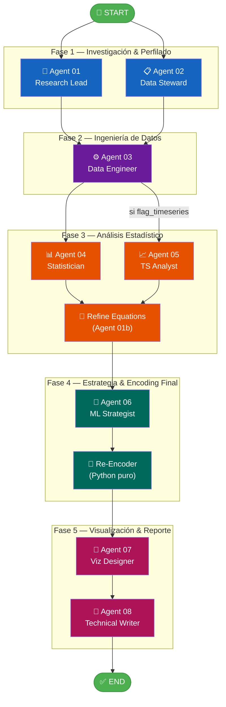

# EDA Agents

Sistema multi-agente de **Analisis Exploratorio de Datos** (EDA) construido con LangGraph y Claude API. Ejecuta un pipeline de 8 agentes especializados que analiza datasets tabulares o de series de tiempo, y genera un informe completo con hipotesis, estadisticas, visualizaciones y recomendaciones de modelos.

## Arquitectura del Sistema



### Flujo del Pipeline

1. **Fase 1 (paralelo):** `Research Lead` formula hipótesis y busca literatura mientras `Data Steward` perfila el dataset y hace train/test split.
2. **Fase 2:** `Data Engineer` aplica encoding provisional, **resampling multiclass** (3 variantes: oversample/undersample/hybrid sobre todas las clases, selección automática por score) y feature engineering.
3. **Fase 3 (paralelo condicional):** `Statistician` ejecuta EDA tabular (correlaciones, VIF, Breusch-Pagan). Si `flag_timeseries=True`, `TS Analyst` corre en paralelo (ADF, KPSS, ARIMA). Luego `Refine Equations` mejora las ecuaciones PICO con los hallazgos.
4. **Fase 4:** `ML Strategist` recomienda modelos y `Re-Encoder` re-aplica encoding final según `model_family` (linear→Frequency, tree→Label).
5. **Fase 5:** `Viz Designer` genera 11+ figuras interactivas y `Technical Writer` produce el informe final, reporte HTML dinámico y notebook Jupyter reproducible.

## Los 8 Agentes + 2 Nodos Auxiliares

| # | Agente | Responsabilidad |
|---|--------|----------------|
| 1 | **Research Lead** | Genera ecuaciones PICO, busca literatura con Claude, formula 3 hipótesis (confirmatoria, exploratoria, alternativa), infiere tipo de tarea |
| 1b | **Refine Equations** | Refina ecuaciones de búsqueda PICO usando los hallazgos estadísticos del Statistician |
| 2 | **Data Steward** | Perfila columnas, detecta tipos, calcula nulos/cardinalidad, hace train/test split, detecta desbalance y series temporales |
| 3 | **Data Engineer** | Aplica encoding (OHE/Label/Ordinal), resampling multiclass (oversample/undersample/hybrid sobre TODAS las clases), feature engineering, genera datasets provisionales |
| 4 | **Statistician** | EDA tabular: correlaciones, test de Breusch-Pagan, VIF completo, medianas, distribución del target |
| 5 | **TS Analyst** | Análisis de series de tiempo: estacionariedad (ADF/KPSS), detección de cambios, ARIMA/SARIMA/SARIMAX/VAR (solo si flag_timeseries=True) |
| 6 | **ML Strategist** | Recomienda modelos, hiperparámetros, técnica de búsqueda, métrica principal, define model_family (linear/tree) |
| — | **Re-Encoder** | Nodo Python puro: re-aplica encoding final según model_family (linear→Frequency, tree→Label) |
| 7 | **Viz Designer** | Genera 11+ figuras interactivas Plotly con exportación kaleido estable (single-process Chromium): correlaciones, distribuciones multi-fila, boxplots, pairplot, target, VIF (barras color-código), Q-Q normalidad, residuales Breusch-Pagan |
| 8 | **Technical Writer** | Produce informe `report.md`, reporte HTML dinámico con navegación lateral y tema claro/oscuro, y notebook Jupyter con código 100% ejecutable |

## Stack Tecnologico

- **Python 3.10+**
- **LangGraph** — Orquestacion del grafo de agentes con paralelismo
- **Claude API** (claude-sonnet-4-5) — LLM para todos los agentes
- **Pandas / NumPy / SciPy / Statsmodels / Scikit-learn** — Procesamiento y estadistica
- **Matplotlib / Seaborn / Plotly** — Visualizaciones
- **Pydantic v2** — Validacion de estado
- **structlog** — Logging estructurado

## Requisitos Previos

- Python 3.10 o superior
- Una API key de [Anthropic](https://console.anthropic.com/)

## Instalacion

```bash
# Clonar el repositorio
git clone https://github.com/jaquimbayoc7/Agentes-EDA.git
cd Agentes-EDA/eda-agents

# Crear entorno virtual
python -m venv .venv

# Activar entorno virtual
# Windows:
.venv\Scripts\activate
# Linux/Mac:
source .venv/bin/activate

# Instalar dependencias
pip install -e ".[dev]"
```

## Configuracion

### 1. API Key

Crea un archivo `.env` en la carpeta `eda-agents/`:

```bash
cp .env.example .env
```

Edita `.env` y agrega tu API key real:

```
ANTHROPIC_API_KEY=sk-ant-api03-TU-CLAVE-AQUI
```

### 2. Parametros del Pipeline (opcional)

El archivo `config/pipeline.yaml` contiene todos los umbrales centralizados:

```yaml
random_seed: 42
model: claude-sonnet-4-5
max_tokens: 4096

imbalance_thresholds:
  oversample: 3
  hybrid: 10
  undersample: 30

vif_threshold: 10
bp_pvalue: 0.05

encoding:
  ohe_max_categories: 3

split:
  test_size: 0.2
  stratify: true
```

## Uso

### Colocar tus datos

Coloca tus archivos CSV en la carpeta `data/`:

```
eda-agents/
  data/
    mi_dataset.csv
    ventas_2024.csv
    ...
```

### Ejecutar el pipeline

```bash
python main.py \
  --question "Tu pregunta de investigacion" \
  --dataset data/mi_dataset.csv \
  --data-type tabular \
  --target nombre_columna_objetivo
```

### Parametros

| Parametro | Requerido | Valores | Descripcion |
|-----------|-----------|---------|-------------|
| `--question` | Si | texto libre | Pregunta de investigacion que guia el analisis |
| `--dataset` | Si | ruta CSV | Ruta al archivo de datos |
| `--data-type` | Si | `tabular` / `timeseries` | Tipo de datos a analizar |
| `--target` | Si | nombre columna | Columna objetivo del analisis |
| `--resume` | No | run_id | ID de una ejecucion previa para reanudar |

### Ejemplos

**Datos tabulares:**
```bash
python main.py \
  --question "Que factores predicen el precio de venta" \
  --dataset data/ventas.csv \
  --data-type tabular \
  --target precio_venta
```

**Series de tiempo:**
```bash
python main.py \
  --question "Cual es la tendencia y estacionalidad de las ventas mensuales" \
  --dataset data/ventas_mensuales.csv \
  --data-type timeseries \
  --target ventas
```

**Reanudar un pipeline interrumpido:**
```bash
python main.py \
  --question "..." \
  --dataset data/mi_dataset.csv \
  --data-type tabular \
  --target target \
  --resume abc12345
```

## Salida

Cada ejecucion genera una carpeta en `outputs/<run_id>/`:

```
outputs/<run_id>/
  report.md                    # Informe completo (secciones 1-12)
  decision.json                # Tarea, modelos, metrica, model_family
  state_final.json             # Estado completo del grafo
  run.log.jsonl                # Log estructurado de la ejecucion
  train.csv                    # Split de entrenamiento original
  test.csv                     # Split de prueba original
  dataset_train_provisional.csv   # Train con encoding provisional
  dataset_train_final.csv      # Train con encoding final
  dataset_test_procesado.csv   # Test procesado
  dataset_test_final.csv       # Test con encoding final
  figures/
    corr_matrix.png            # Matriz de correlaciones
    dist_*.png                 # Distribuciones de variables (multi-fila)
    box_*.png                  # Boxplots
    pairplot.png               # Pairplot top-6 numéricas
    target_dist.png            # Distribución del target
    vif_bar.png                # Barras VIF color-código
    qq_normality.png           # Q-Q plots de normalidad
    bp_residuals.png           # Residuales Breusch-Pagan
  reportesFinales/
    reporte_eda.html           # Pagina HTML dinamica con todo el EDA
  notebooksFinales/
    eda_reproducible_<run_id>.ipynb  # Notebook Jupyter reproducible
```

### Reporte HTML Dinámico

Se genera automáticamente una página HTML auto-contenida en `reportesFinales/` con:
- **Secciones colapsables** con animación chevron (click para expandir/colapsar)
- **Barra de progreso** de scroll en la parte superior
- Navegación lateral por secciones con íconos emoji
- Figuras embebidas (base64) en **grid responsivo** con **lightbox** (navegación ←→, teclado, contador)
- Exportación a **400 DPI** por figura + **descarga ZIP** de todas las figuras
- Tablas ordenables y KPIs visuales con gradiente de acento
- Tema claro/oscuro
- Sección de **Normalidad** con tabla de resultados por variable
- Sección de **VIF** con tabla color-código (rojo >10, naranja 5-10, verde <5)
- Sección de **Breusch-Pagan** con resultado de heterocedasticidad
- **Hallazgos EDA** organizados en **4 tabs** (Resumen/Correlaciones/Outliers/Top Features) con KPIs resumen
- **Referencias** en **tabla buscable/ordenable** con toolbar de exportación a **Excel (SheetJS)** y **CSV**
- Botones de descarga (CSV, JSON, notebook)
- **Notificaciones toast** para feedback de acciones
- **Print-friendly**: oculta UI interactiva y expande secciones al imprimir
- CDN on-demand: SheetJS y JSZip se cargan solo cuando el usuario exporta

### Notebook Reproducible (Código Ejecutable)

Se genera automáticamente un notebook Jupyter en `notebooksFinales/` con **código 100% ejecutable** — nada precalculado. Cada celda computa resultados en vivo desde el CSV original, tal como lo haría un científico de datos:

| Sección | Qué computa en vivo |
|---------|--------------------|
| **1. Setup** | Importaciones (pandas, scipy, statsmodels, sklearn, plotly) |
| **2. Carga y Perfil** | `df.info()`, `df.describe()`, análisis de nulos y cardinalidad |
| **3. Hipótesis** | Formuladas por el Research Lead |
| **4. Train/Test Split** | `train_test_split()` con el mismo seed del pipeline |
| **5. Encoding** | `pd.get_dummies()` (OHE), `.map()` (Label), `.value_counts()` (Frequency) paso a paso |
| **6. EDA Visual** | Correlaciones Spearman, histogramas, boxplots con IQR, scatter matrix (Plotly) |
| **7. Tests Estadísticos** | `scipy.stats.shapiro()`, `variance_inflation_factor()`, `het_breuschpagan()`, Q-Q plots |
| **8. Feature Importance** | `mutual_info_regression/classif()`, `permutation_importance()` con RandomForest |
| **9. Modelado** | `GridSearchCV` con el modelo recomendado, evaluación en test |

Del state del pipeline solo se usa **configuración** (dataset_path, target, seed, encoding recipe, modelos recomendados) — los resultados se computan desde cero para que el investigador pueda verificar cada paso.

Cada celda markdown incluye **comentarios técnicos enriquecidos**: marco CRISP-DM, explicación de data leakage, comparación de técnicas de encoding, tabla comparativa oversample/undersample/hybrid, fórmula IQR para outliers, criterios Shapiro-Wilk/Anderson-Darling, umbrales VIF, hipótesis Breusch-Pagan, y conexión explícita con las hipótesis H1/H2/H3 de la investigación.

### Ejemplo de `decision.json`

```json
{
  "tarea": "regression",
  "modelos_recomendados": [
    {"name": "Ridge", "reason": "N bajo -> regularizacion"}
  ],
  "hyperparams_technique": "GridSearchCV",
  "model_family": "linear",
  "metrica_principal": "RMSE"
}
```

## Estructura del Proyecto

```
eda-agents/
  main.py                    # CLI - punto de entrada
  pyproject.toml             # Dependencias y metadata
  config/
    pipeline.yaml            # Umbrales centralizados
  data/                      # Coloca tus CSVs aqui
  src/
    state.py                 # EDAState TypedDict (estado compartido)
    graph.py                 # StateGraph con paralelismo LangGraph
    agents/
      agent_01_research_lead.py
      agent_02_data_steward.py
      agent_03_data_engineer.py
      agent_04_statistician.py
      agent_05_ts_analyst.py
      agent_06_ml_strategist.py
      agent_07_viz_designer.py
      agent_08_technical_writer.py
    skills/
      encoding.py            # OHE, Label, Ordinal, Frequency encoding
      report_builder.py      # Generacion del informe markdown
      html_report.py         # Generacion de pagina HTML dinamica
      notebook_builder.py    # Notebook Jupyter con código ejecutable (sin resultados precalculados)
      statistical_tests.py   # Breusch-Pagan, VIF, correlaciones
      timeseries.py          # ADF, KPSS, deteccion de cambios
    utils/
      config.py              # PipelineConfig (carga YAML + .env)
      llm.py                 # Cliente Claude (call_claude, call_claude_json)
      logger.py              # structlog configurado
      sanitize.py            # Sanitizacion recursiva de tipos numpy
      state_validator.py     # Validacion Pydantic del estado
  tests/
    test_agents.py           # Tests de los 8 agentes
    test_config.py           # Tests de configuracion
    test_graph.py            # Tests del grafo completo
    test_llm.py              # Tests del cliente Claude
    test_main.py             # Tests end-to-end del pipeline
    test_skills.py           # Tests de encoding, stats, timeseries
    test_state.py            # Tests del estado
    test_validator.py        # Tests de validacion
    fixtures/
      sample_100.csv         # Dataset de prueba (100 filas)
  outputs/                   # Generado automaticamente por cada run
```

## Tests

```bash
# Ejecutar todos los tests
pytest tests/ -v

# Con cobertura
pytest tests/ --cov=src --cov-report=term-missing

# Solo un modulo
pytest tests/test_agents.py -v
```

**197 tests** cubren agentes, skills, grafo, estado, validación, HTML report, notebook builder (código ejecutable), sanitización numpy y pipeline end-to-end.

## Convenciones del Proyecto

- `fit()` solo sobre `train_path`, nunca sobre el dataset completo
- Cada agente retorna un dict parcial, nunca muta el estado directamente
- `agent_status` siempre se escribe: `"ok"` / `"fallback"` / `"error"`
- `RANDOM_SEED` se lee de config, nunca se hardcodea
- Outputs en `outputs/{run_id}/` — nunca se sobreescriben runs anteriores
- Toda la comunicacion con LLM pasa por `src/utils/llm.py`

## Licencia

MIT
